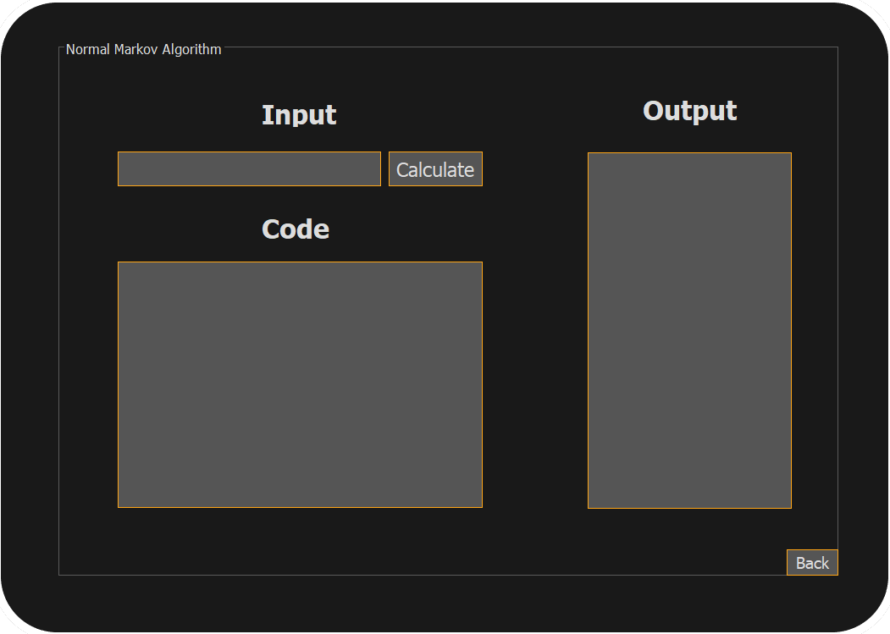

# Mathematical logic and theory of algorithms application
## What is this for?
This application allows you not to write code of your formal algorithms on a paper! Now, instead of it, you can write them here and test them in real-time in a few seconds!

## What algorithms are implied?
There 3 types of algorithms available for writing:

## How does it look like?
First you get to the main menu where you can choose the type of algorythm to code

*picture in progress*

Markov algorithm interface is looking like that:

